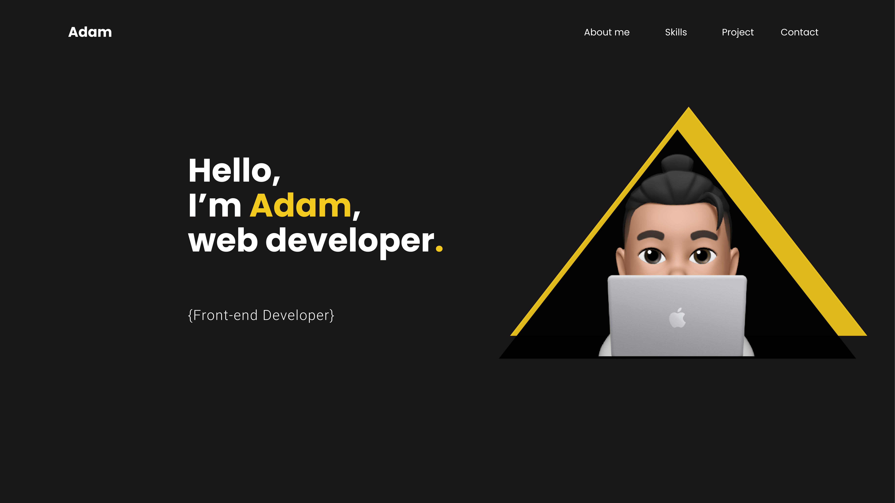

# Portfolio

<hr>


<hr>
<br>


<br>

<hr>
<br>

## Features
<br>


⚡️ Modern UI Design 
⚡️ One Page Layout\
⚡️ Styled Custom with SCSS\
⚡️ Fully Responsive\
⚡️ Valid HTML5 & CSS3\

<hr>
<br>

### Prerequisites 📋

You'll need [Git](https://git-scm.com) and [Node.js](https://nodejs.org/en/download/) (which comes with [NPM](http://npmjs.com)) installed on your computer.

```
node@v16.4.2 or higher
npm@7.18.1 or higher
git@2.30.1 or higher
```

Also, you can use [Yarn](https://yarnpkg.com/) instead of NPM ☝️

<hr>
<br>

### Installation:
<br>

`npm install`   
<br>
<br>
To Start Server:
<br>
<br>
`npm start`  
<br>

To Visit App:

`http://localhost:3001`  
<hr>

## Authors

- **Adam Ammour** - [https://github.com/Neyzoh](https://github.com/Neyzoh)
